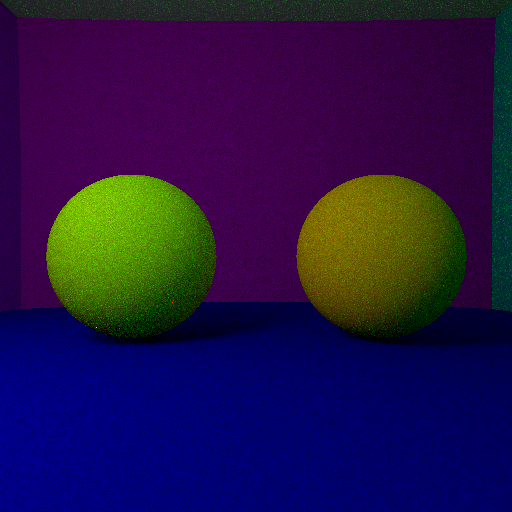

**Martin CHAUVIN - MOS Informatique Graphique - Ecole Centrale Lyon**

# Ray Tracer 

Nous avons réalisé un ray tracer. Il s'agit d'une application visant à représenter une scène 3D en étant le plus fidèle à la réalité. Cette méthode est notamment utilisé au cinéma car, bien qu'étant plus couteuse (en temps de calcul), elle offre une meilleure fidélité des interactions lumières-matières.

Dans ce rapport, nous allons présenter un panel des méthodes utilisées lors de la réalisation de ce projet. La totalité du code contenant bien plus de fonctionnalités que celles présentées ici est disponible dans  le dossier `code`.

La scène que nous allons représenter est la suivante :

Il s'agit de 6 sphères géantes créant une pièce dans laquelle se trouve une sphère *miroir*, une sphère transparente et une femme, le tout éclairé par une lumière blanche.

Notre objectif est donc de représenter en 3D cette scène de manière le plus réaliste possible. Pour cela, nous avons implémenté plusieurs méthodes afin de raffiner toujours plus la représentation et de diminuer le temps de calcul. 

En lançant un rayon depuis un pixel de la caméra, on va suivre le chemin de ce rayon et déterminer ses intersections, puis en fonction de celles-ci, on en déduit la couleur à afficher à l'écran.

## Ombres portées

La première fonctionnalité implémenté a été les ombres portées. Pour obtenir un rendu réaliste, nous avons mis en place différents algorithmes. 

Tout d'abord, on a une ombre si le rayon lancé depuis le caméra intersecte une surface qui n'est pas en vision directe de la source de lumière. Ce procédé produit une ombre toute noire sous la sphère. 

Afin d'améliorer ce rendu, on décide d'adopter un comportement plus réel de la lumière. En effet, un rayon de lumière n'est que très rarement réfléchi symétriquement par rapport à la normale à la surface qu'il intersecte. Il est ainsi réfléchi dans une direction aléatoire avec une distribution de probabilités centrée autour du rayon réfléchi *parfait*.

Cela a pour conséquence d'adoucir l'ombre car la zone dans l'ombre est également éclairée indirectement.

Finalement, afin de ne plus avoir des ombres aussi marquées, on va considérer la lumière, jusqu'alors ponctuelle, comme une sphère. On obtient alors le résultat présenté ci-dessous :

Les ombres y sont douces et plus sombres proche de l'objet.

*Note :* l'image est bruitée à cause de la mise en place de la lumière indirect.

## Flou de profondeur et anti aliasing

Afin d'améliorer le réalisme de notre scène, on décide désormais d'implémenter la notion de flou de profondeur.

Un objet est flou s'il n'est pas dans le plan focal. Dans le cas d'un ray tracer, chaque rayon lancé à partir d'un pixel doit passer par le point du plan focal que sa direction intersecte. Donc en lançant des rayons légèrement décalés les uns par rapport aux autres et passant tous par ce point du plan focal puis en moyennant les résultats obtenus, on obtiendra un effet de flou. En effet, si l'objet est dans le plan focal, tous les rayons retourneront la même valeur et l'objet sera net. Par contre s'il n'est pas dans le plan focal, chaque rayon transmettra une information différente et l'objet apparaitra flou.

Le résultat ainsi obtenu est le suivant :

La sphère spéculaire est dans le plan focal et apparait bien nette alors que la sphère au fond n'y est pas et est plus floue.

Toujours dans l'objectif d'améliorer le réalisme, on constate que nos images sont pixelisées, comme sur l'image ci-dessous :

Les bords des sphères apparaissent crénelés. Pour remédier à cela, on pratique l'anti-aliasing, il s'agit d'une méthode visant à envoyer des rayons depuis un pixel dans de multiple directions afin de flouter l'image au niveau de ces créneaux.

Sur l'image ci-dessus est illustré l'effet de l'anti-aliasing. En faisant un zoom sur la sphère spéculaire, on remarque que sans anti-aliasing, les sphères reflétées sont crénelées, on a l'impression de pixellisation. Tandis qu'avec la correction par anti-aliasing, les bords apparaissent plus doux à l'œil.

## Les maillages

Nous souhaitons désormais inclure un objet plus complexe que de simples sphères. Ces objets sont représentés par des maillages, c'est-à-dire un très grand nombre de triangles dessinant la surface extérieur de l'objet. 

Le nombre de triangles d'un maillage étant très élevé, il est extrêmement couteux de représenté un objet. En effet, pour chaque rayon lancé, il est nécessaire de tester chacun des triangles du maillages pour vérifier s'il intersecte ou non le rayon.

Afin de limiter le temps de calcul, on s'appuie sur le fait qu'il n'est pas nécessaire de tester tous les triangles du maillage lorsque le rayon n'a aucune chance de les intersecter. On construit alors un arbre récursif de boites englobantes de telle manière que la première boite englobe tout le maillage et que chacun de ces 2 enfants englobe la moitié du maillage du parent (voir figure ci-dessous).

Cette méthode permet de diviser le temps de calcul par plus de 9 (test réalisé avec une seule boite englobante contre un arbre de boites englobantes).

L'image ainsi générée est la suivante :

Le modèle apparait bien. Cependant le maillage étant une représentation discrète, on constate que l'on peut observer à l'œil nu des arrêtes très marquées et non des courbes (notamment au niveau des jambes).

Pour remédier à cela le modèle inclus des normales apparentes. Il s'agit de la normale selon laquelle la lumière devrait être reflétée si elle arrivait en ce point. Ainsi un rayon intersectant un triangle en un point donné sera réfléchi non pas symétriquement par rapport à la normale à la surface mais symétriquement par rapport à la normale apparente en ce point. Cette normale apparente est obtenu par le calcul du barycentre des normales fournies par le modèle aux sommets en ce point. Ainsi si l'on appelle A, B et C les 3 sommets du triangles et $\alpha$, $\beta$, et $\gamma$ les coordonnées barycentrique du point d'intersection P, on a $N_{apparente P} = \alpha N_{apparente A} + \beta N_{apparente B} + \gamma N_{apparente C}$ comme indiqué sur le schéma ci-dessous.

Le résultat alors obtenu est le suivant :

Comme on peut le constater ici, on ne distingue plus les arrêtes du maillage. 

Cependant on observe l'apparition de bruit autour du modèle, celui-ci est dû à l'opération de lissage que  nous venons de réaliser. Ceci est vérifié sur la figure ci-dessous où tout le bruit est couvert (par transparence) par le modèle avec des arrêtes saillantes. En effet, là où apparait le bruit, il y a normalement une partie du modèle mais nous avons fait en sorte de ne pas l'afficher, le programme a alors du mal à gérer la transparence. 

## Performances

Le résultat très haute définition final obtenu est le suivant :

Il s'agit d'une image 1024x1024 pour laquelle 500 rayons par pixel ont été lancés, cet image à environ pris 5h30 a être générée. Cet image a été très lente à créer car mon processeur est très lent et ne dépasse que très difficilement 1.8GHz, sur un ordinateur plus performant, avec notamment une carte graphique, on aurait pu très largement diminuer ce temps d'exécution.